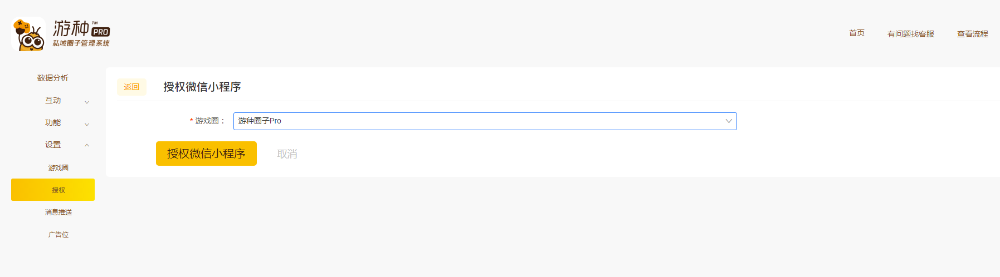
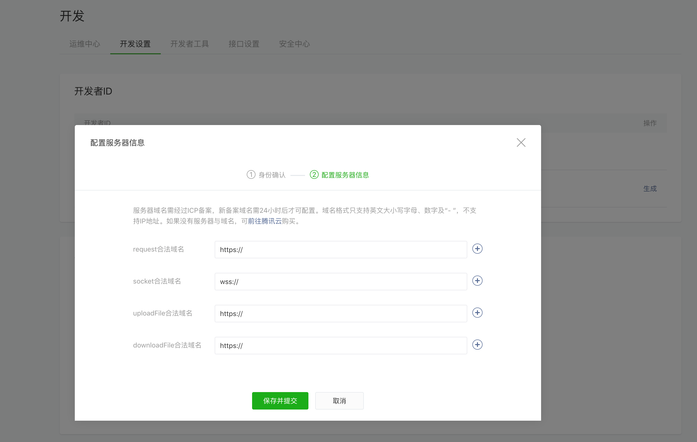
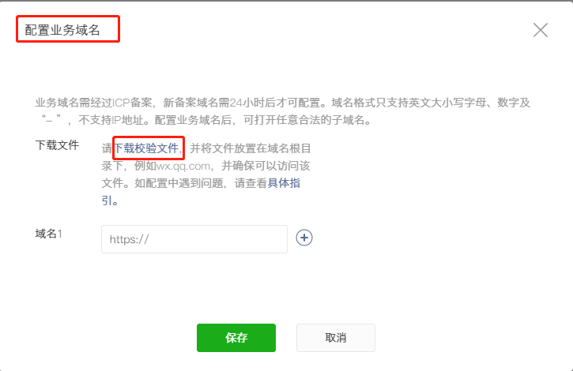

#### 2.7授权管理

选择授权微信小程序

配置域名：（后期会随添加/更新）

**request合法域名：** 

https://apimp.3l7c.com

https://log.aldwx.com
 
**socket合法域名： **

wss:://apimp.3l7c.com
 
**uploadFile合法域名：** 

https://apimp.3l7c.com

https://up-z1.qiniup.com

https://up-z2.qiniup.com

https://up.qiniup.com
 
**downloadFlie合法域名：** 

https://qrss.3l7c.com

https://wx.qlogo.cn

### 将配置域名复制到微信后台
【[打开微信后台](https://mp.weixin.qq.com)】---【开发】---【开发设置】

第三步：这一步需要填写2个字段“AppID”，“AppSecret”

【登录微信公众平台】---【开发】---【开发设置】

第四步：配置业务域名
【登录微信公众平台】---【开发】---【业务域名】---【开始配置】---【下载校验文件】---【返回游种圈子后台】----【提交txt文件】---【授权】

