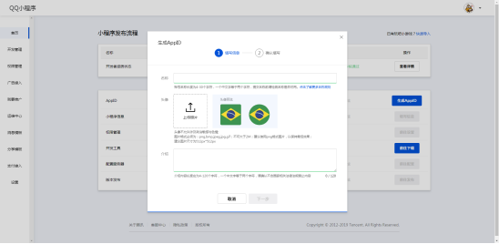
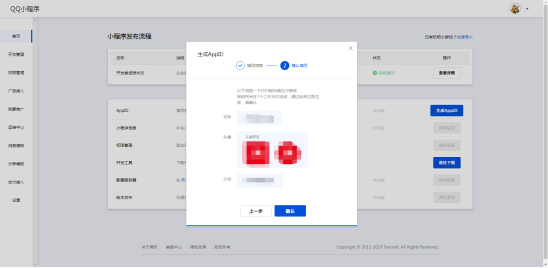
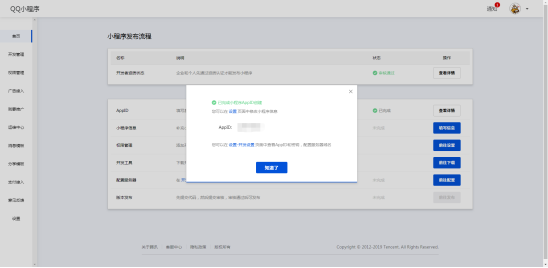

#### 3.10授权管理

选择授权QQ小程序

**request合法域名：** 

https://apimp.3l7c.com

https://log.aldwx.com
 
**socket合法域名： **

wss:://apimp.3l7c.com
 
**uploadFile合法域名：** 

https://apimp.3l7c.com

https://up-z1.qiniup.com

https://up-z2.qiniup.com

https://up.qiniup.com
 
**downloadFlie合法域名：** 

https://qrss.3l7c.com

https://wx.qlogo.cn

这一步需要填写2个字段“AppID”，“AppSecret”
【登录QQ小程序开发者平台】---【首页】---【生成AppID】

填写信息

确认填写

得到AppID

可以在设置-开发设置页面中查看AppID和密钥，配置服务器域名

