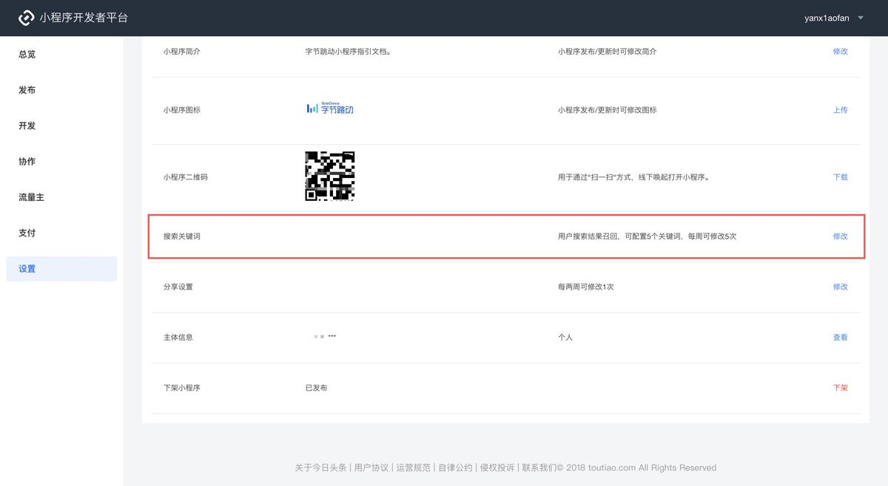
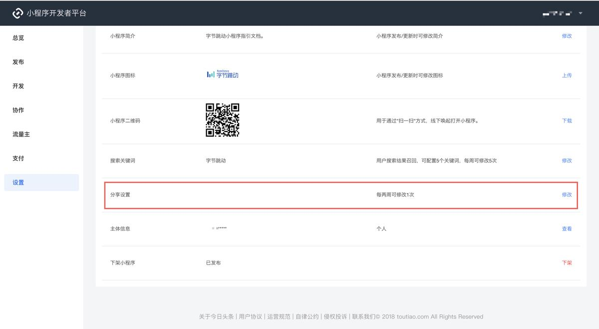
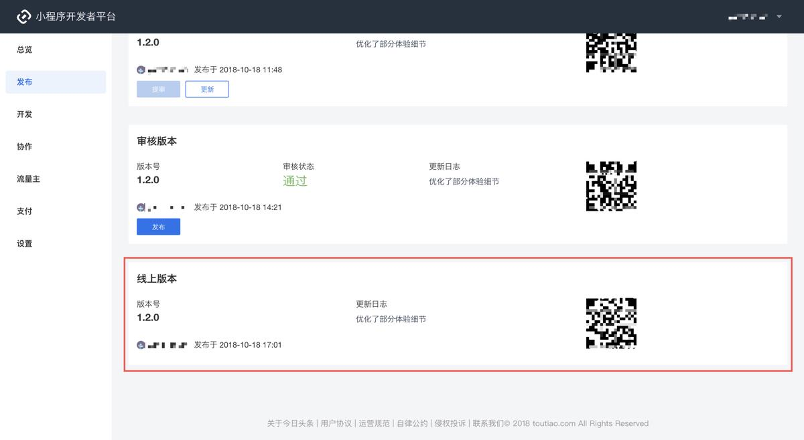

#### 4.14发布小程序

**设置搜索关键词与分享**

当发布未配置搜索关键词与分享内容版本时，会弹出提示与跳转地址，点击【前往配置】。

如果已有搜索关键词和分享内容，想要查看或进行修改，可以在小程序详情页中的【设置】进行相应的配置。 配置搜索关键词：提交的搜索关键词应符合 [小程序关键词搜索](https://developer.toutiao.com/docs/operations/spec.html#_2-%E5%B0%8F%E7%A8%8B%E5%BA%8F%E8%A7%84%E8%8C%83)

通过审核并且配置过搜索关键词与分享内容的版本，在【审核版本】中点击发布即可将小程序发布至线上。

